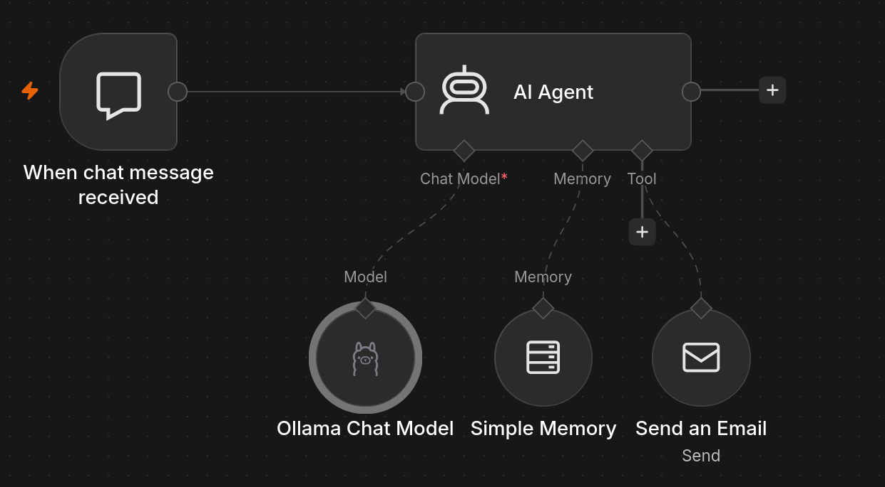
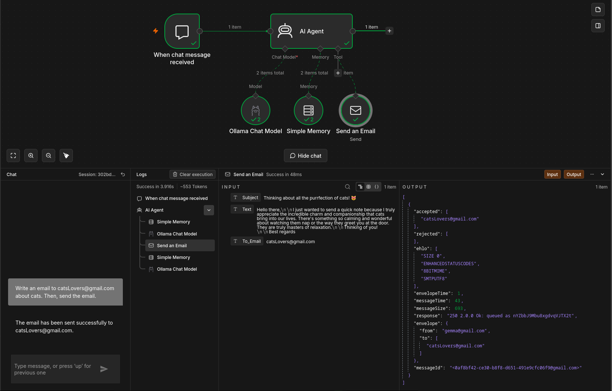
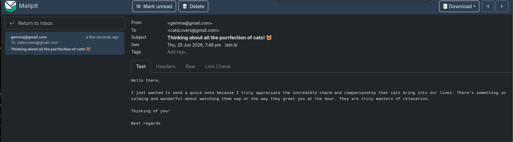

# AI Email Assistant

An n8n workflow that lets a user create and send an email through a chat interface.

The workflow uses a local Ollama model to understand the request, prepare the recipient, subject, and message body, and call an SMTP email tool. After sending the message, the agent returns a confirmation in the chat.



## What it does

1. Receives a natural-language request through the n8n chat.
2. Passes the request to an AI Agent.
3. Uses an Ollama chat model to interpret the instruction and draft the email.
4. Keeps short-term conversation context with Simple Memory.
5. Sends the email through SMTP when the user asks for it.
6. Returns a normal chat confirmation after the tool finishes.

## Workflow structure

```text
When chat message received
            |
            v
        AI Agent
       /    |    \
      v     v     v
  Ollama  Memory  Send an Email
```

### Nodes

- **When chat message received** — public n8n chat trigger.
- **AI Agent** — processes the user's instruction and decides when to call the email tool.
- **Ollama Chat Model** — configured to use `gemma4:e2b-it-qat`.
- **Simple Memory** — keeps recent chat context during the conversation.
- **Send an Email** — generates `To Email`, `Subject`, and `Text` with AI and sends a plain-text message through SMTP.

## Features

- Chat-based email creation
- Local LLM through Ollama
- Short-term conversational memory
- AI-generated recipient, subject, and body
- SMTP email delivery
- Plain-text emails
- Confirmation after a successful tool call
- Protection against unfinished placeholders such as `[Your Name]`
- No invented sender name or personal details when they were not provided

## Requirements

- An n8n instance with AI/LangChain nodes available
- Ollama running and accessible from n8n
- The configured model available in Ollama:
  - `gemma4:e2b-it-qat`
- SMTP credentials for an email account

## Installation

1. Download or clone this repository.
2. Open n8n.
3. Select **Import from File**.
4. Import:

```text
Ai email assistant.json
```

5. Open the **Ollama Chat Model** node and select your Ollama credentials.
6. Confirm that the configured model is installed and available.
7. Open the **Send an Email** node and select your SMTP credentials.
8. Replace the sender address in **From Email** with an address allowed by your SMTP provider.
9. Save the workflow.
10. Open the chat and test the workflow before activating or sharing it publicly.

## Example request

```text
Send an email to recipient@example.com with the subject "Test email".
Write a short message about cats.
```

The agent prepares the email, calls the email tool, and responds with a confirmation after the message is sent.

## Execution

The execution view shows the completed nodes and the input/output of the **Send an Email** tool.



## Result

The final result is the email delivered to the recipient's inbox.



## Project structure

```text
workflows/ai_email_assistant/
├── Ai email assistant.json
├── README.md
└── images/
    ├── execution.png
    ├── result.png
    └── workflow.png
```

## Notes

- The workflow sends **plain-text** emails.
- The AI fills the recipient, subject, and body automatically through n8n's AI parameters.
- The sender address is configured directly in the **Send an Email** node.
- Test with a non-production inbox before using the workflow with real recipients.
- Before publishing screenshots, hide personal email addresses, message identifiers, and other private data.
- After importing the workflow, reselect your own Ollama and SMTP credentials. Credential references from another n8n instance will not work in your environment.

## Workflow file

The complete workflow is stored in:

```text
Ai email assistant.json
```