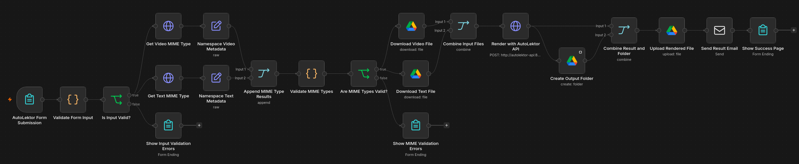
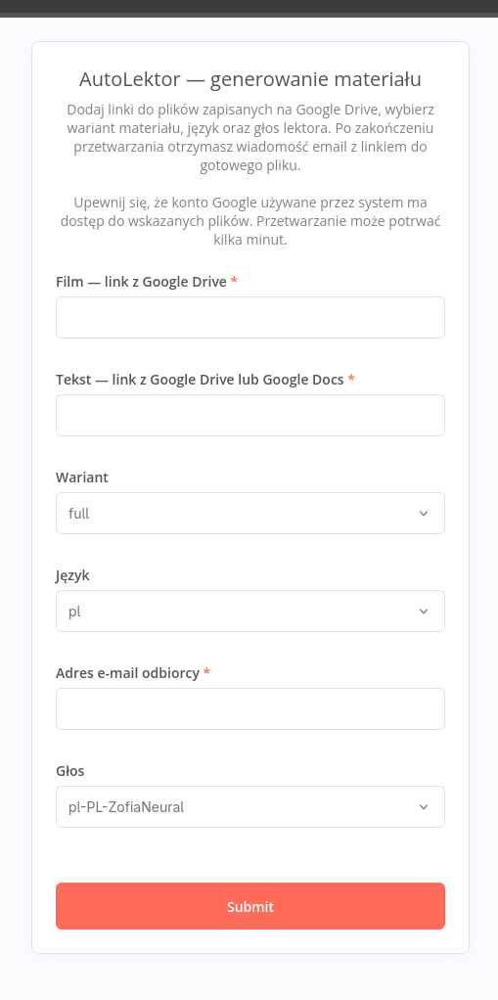
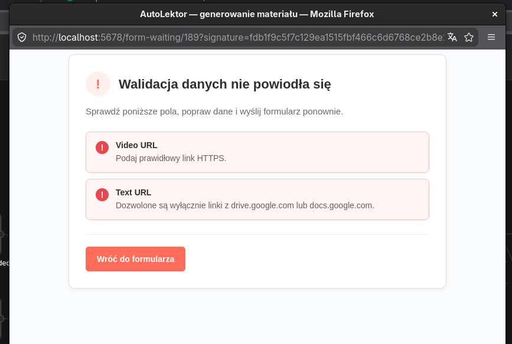
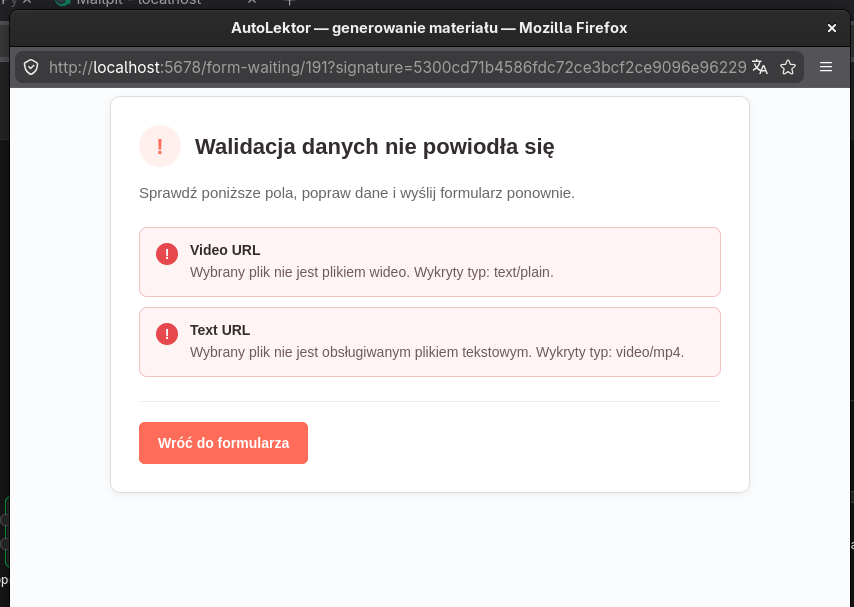
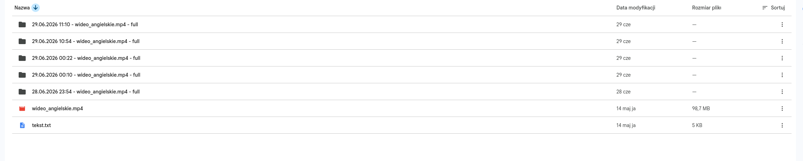
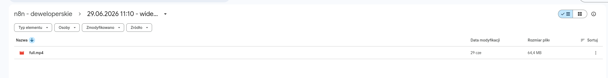
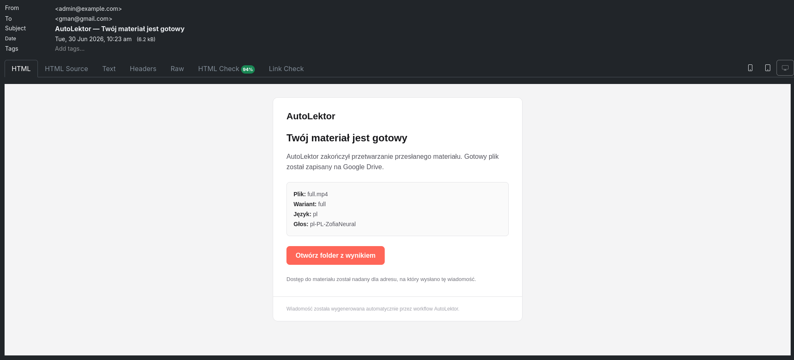
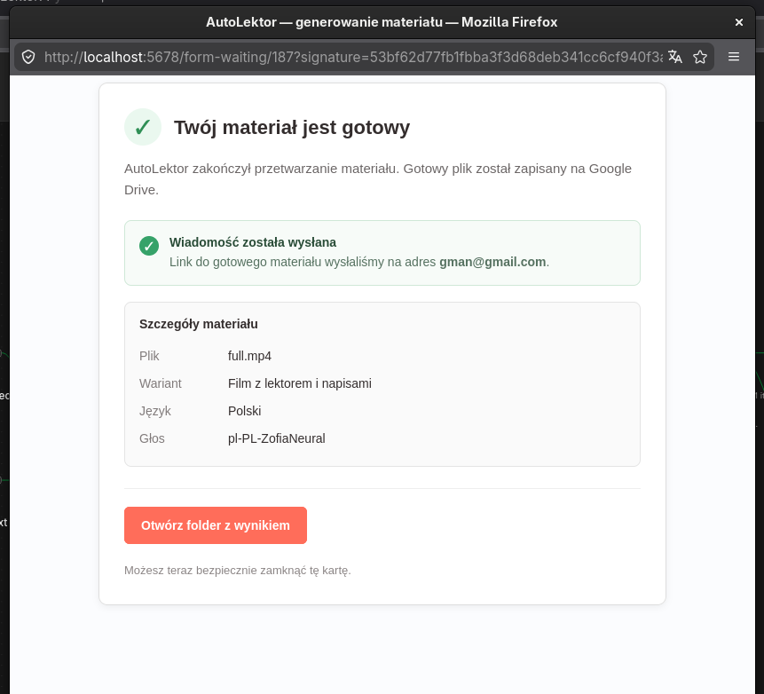
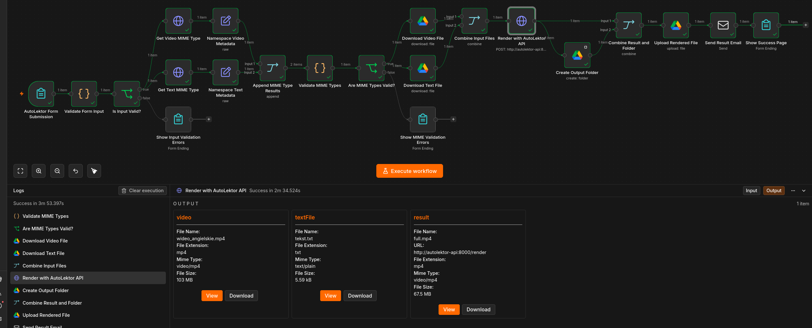

# AutoLektor n8n Workflow

An end-to-end n8n workflow for generating voiceovers, subtitles, and rendered video variants from files stored on Google Drive.

The workflow:

- collects request data through an n8n Form,
- validates form fields and Google Drive links,
- verifies source file MIME types,
- downloads an MP4 video and a UTF-8 TXT file,
- sends both files to the AutoLektor HTTP API,
- creates a dedicated Google Drive output folder,
- uploads the rendered result,
- sends an email containing the result link,
- displays styled success and validation error pages.



## Important: AutoLektor API image is required

This workflow depends on the separate [AutoLektor](https://github.com/karoljaro/AutoLektor) project.

The AutoLektor image is **not published as a public Docker Hub image**, so it must be built locally before this workflow can render files.

The workflow calls:

```text
http://autolektor-api:8000/render
```

The AutoLektor container must therefore:

1. run in the same container network as n8n,
2. use the service name `autolektor-api`, or the URL in the `Render with AutoLektor API` node must be changed,
3. expose port `8000` inside the container network.

### Build the CPU image with Podman

```bash
git clone https://github.com/karoljaro/AutoLektor.git
cd AutoLektor

podman build \
  --format docker \
  -t localhost/autolektor-api:cpu \
  .
```

The Docker image format keeps the image health check available when building with Podman.

### Build the CPU image with Docker

```bash
git clone https://github.com/karoljaro/AutoLektor.git
cd AutoLektor

docker build \
  -t autolektor-api:cpu \
  .
```

When using Docker, either update the image name in Compose to `autolektor-api:cpu` or build it with the same tag used by your Compose configuration.

### Example Compose service

Add the service to the same Compose project and network as n8n:

```yaml
services:
  autolektor-api:
    profiles:
      - autolektor

    image: localhost/autolektor-api:cpu
    pull_policy: never
    restart: unless-stopped

    environment:
      AUTOLEKTOR_WHISPER_MODEL: ${AUTOLEKTOR_WHISPER_MODEL:-small}

    ports:
      - "127.0.0.1:${AUTOLEKTOR_PORT:-8000}:8000"

    volumes:
      - autolektor-whisper:/home/autolektor/.cache/whisper

volumes:
  autolektor-whisper:
```

If n8n and AutoLektor are defined in different Compose projects, connect both services to the same explicitly named external network.

Start the stack with the profile enabled:

```bash
podman compose --profile autolektor up -d
```

or:

```bash
docker compose --profile autolektor up -d
```

Check the API:

```bash
curl http://127.0.0.1:8000/health
```

Stop the stack, including the profiled service:

```bash
podman compose --profile autolektor down --remove-orphans
```

or:

```bash
docker compose --profile autolektor down --remove-orphans
```

## Requirements

- self-hosted n8n,
- Docker or Podman with Compose support,
- locally built AutoLektor CPU image,
- Google API credentials with Google Drive access,
- an SMTP server configured in n8n,
- an MP4 source video stored on Google Drive,
- a plain-text `.txt` file stored on Google Drive and encoded as UTF-8.

The included workflow was designed for a local containerized environment. Mailpit can be used as the SMTP server during development.

## Workflow file

Import:

```text
autolektor.json
```

into n8n using:

```text
Workflows → Import from File
```

Credentials are not included in the exported workflow and must be configured after import.

## Configuration after import

### 1. Google credentials

Assign a valid Google API or service-account credential to these nodes:

- `Get Video MIME Type`
- `Get Text MIME Type`
- `Download Video File`
- `Download Text File`
- `Create Output Folder`
- `Upload Rendered File`

The Google account or service account must have access to:

- both input files,
- the destination Drive,
- the parent output folder.

When using a service account, explicitly share the source files and destination folder or Shared Drive with its email address.

### 2. Output location

Open the `Create Output Folder` node and replace the exported values with your own:

- Parent Drive ID
- Parent Folder ID

A separate output folder is created for every successful request.

The generated folder name contains:

```text
date and time - source video name - selected variant
```

### 3. SMTP credentials

Configure the SMTP credential in:

```text
Send Result Email
```

Also replace the example sender address:

```text
admin@example.com
```

with an address accepted by your SMTP server.

### 4. AutoLektor API endpoint

The `Render with AutoLektor API` node uses:

```text
http://autolektor-api:8000/render
```

Keep this value when the Compose service is named `autolektor-api`.

Otherwise, replace the hostname with the actual Compose service name.

The request timeout is set to 15 minutes because CPU rendering and Whisper-based variants can take several minutes.

### 5. Form return links

The styled validation pages contain a link that returns the user to the form.

After importing the workflow, replace any hardcoded local form URL with the current n8n production form URL:

```text
http://localhost:5678/form/...
```

Use the Production URL shown in the `AutoLektor Form Submission` node before publishing the workflow.

### 6. Activate the workflow

After configuring credentials and IDs:

1. save the workflow,
2. publish or activate it,
3. open the Production URL from the form trigger,
4. submit a test request.

## Form input

The form accepts:

| Field | Description |
|---|---|
| Film — link z Google Drive | Google Drive URL pointing to the source MP4 file |
| Tekst TXT — link z Google Drive | Google Drive URL pointing to a UTF-8 `.txt` file |
| Wariant | Output variant generated by AutoLektor |
| Język | Whisper transcription language |
| Głos | Edge TTS voice |
| Adres e-mail odbiorcy | Address that receives the result link |

The form UI and user-facing validation messages are in Polish.



## Output variants

| Variant | Output | Description |
|---|---|---|
| `voiceover` | `voiceover.mp3` | Generated voiceover only |
| `subtitles` | `subtitles.srt` | Generated subtitles only |
| `dubbed` | `dubbed.mp4` | Source video with generated voiceover |
| `subtitled` | `subtitled.mp4` | Source video with original audio and burned subtitles |
| `full` | `full.mp4` | Source video with generated voiceover and burned subtitles |

## Workflow stages

### 1. Form validation

`Validate Form Input` checks:

- required fields,
- email format,
- allowed variants,
- supported languages and voices,
- language and voice compatibility,
- HTTPS Google Drive URLs,
- Google file identifiers,
- links to files instead of folders.

Invalid input is routed to a styled error page.



### 2. Google Drive metadata validation

The workflow retrieves metadata for both source files through the Google Drive API.

`Validate MIME Types` checks that:

- neither source file is in Trash,
- the video is recognized as a video file,
- the text file uses the `text/plain` MIME type.

Invalid file types are routed to a separate styled error page.



### 3. Input download

After successful validation, the workflow downloads the files into separate binary properties:

```text
video
textFile
```

The `Combine Input Files` node combines them into a single n8n item.

### 4. AutoLektor rendering

`Render with AutoLektor API` sends a multipart request containing:

```text
video
text_file
variant
voice
language
```

The rendered response is stored in:

```text
binary.result
```

### 5. Google Drive output

After rendering, the workflow:

1. creates a new request-specific output folder,
2. combines the folder metadata with the rendered binary result,
3. uploads the result into the newly created folder.





### 6. Email and completion page

The workflow sends an HTML email with a Google Drive folder link and then displays a styled completion page.





## Successful execution



## Access to the generated result

The current workflow sends a Google Drive folder link.

Make sure the recipient already has access to the destination Drive or folder. If recipients do not share access to the same Drive, add a Google Drive permission step before `Send Result Email` to grant read access to the generated file or folder.

Do not make the entire destination Drive public only to simplify testing.

## Validation and error handling

The workflow has separate user-facing paths for:

- invalid form data,
- invalid Google Drive file metadata or MIME types,
- normal successful completion.

The AutoLektor API can also return structured business errors during upload, voice generation, subtitle generation, or video rendering. In a production deployment, consider adding an n8n Error Workflow or a dedicated API-error branch for those failures.

## Security notes

- The form is exported without authentication.
- Enable form authentication or protect n8n behind a reverse proxy before exposing it publicly.
- Do not commit exported credentials, tokens, private keys, or SMTP passwords.
- Restrict Google Drive permissions to the folders required by this workflow.
- Keep AutoLektor reachable from the n8n network; public exposure of port `8000` is not required for container-to-container communication.
- The localhost port mapping is useful only for health checks and local testing.

## Project structure

```text
auto_lektor/
├── autolektor.json
├── README.md
└── images/
    ├── workflow.png
    ├── execution_AutoLektor_form_submission.png
    ├── execution_success.png
    ├── execution_invalid_input_data.png
    ├── execution_invalid_mimeTypes.png
    ├── result_created_folder_with_mp4.png
    ├── result_rendered_mp4_inside_folder.png
    ├── result_sended_email_with_link.png
    └── result_success_page.png
```

## Related project

- [AutoLektor](https://github.com/karoljaro/AutoLektor) — Python API and CLI used by this workflow to generate voiceovers, subtitles, dubbed videos, and fully rendered variants.