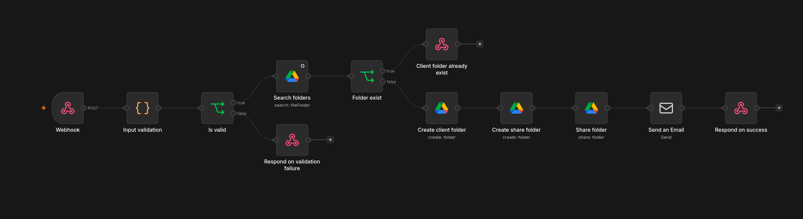
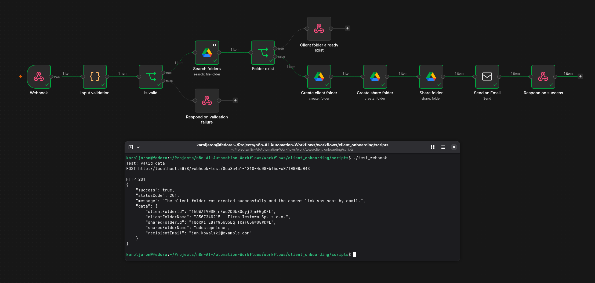
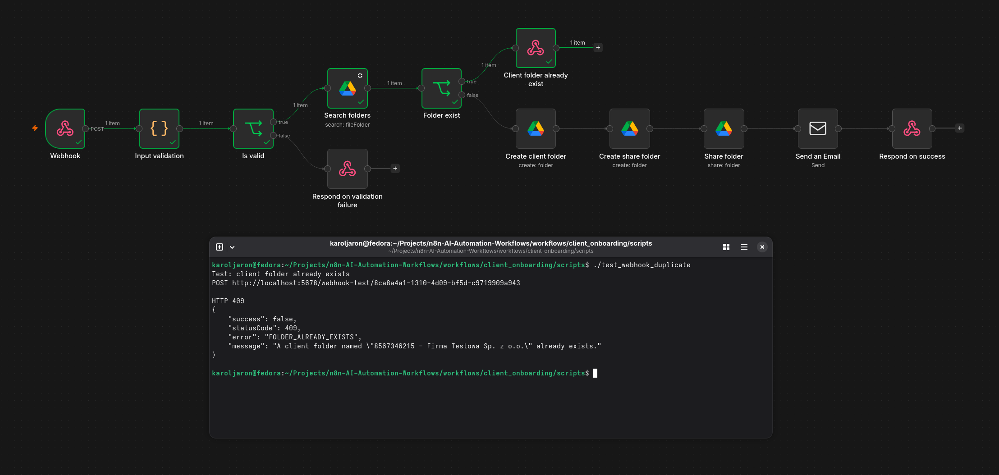
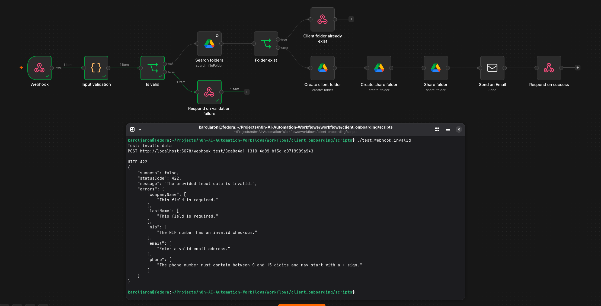
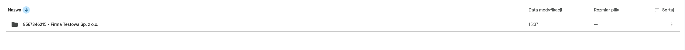
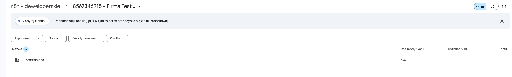
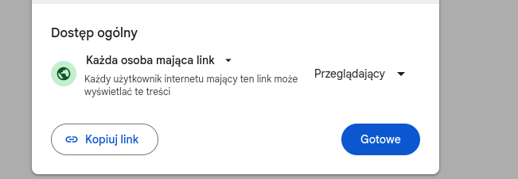
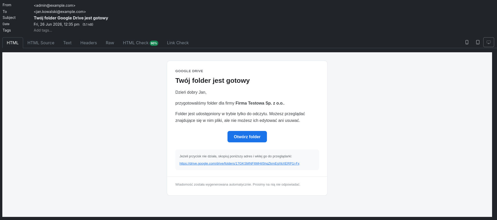

# Client Onboarding Automation

An n8n workflow that automates the initial client onboarding process.

The workflow receives company and contact details through a webhook, validates the input, checks whether the client already exists, creates a dedicated folder structure on Google Shared Drive, shares the client-facing folder in read-only mode, and sends a welcome email containing the access link.



## Workflow overview

```text
Webhook
  ↓
Input validation
  ↓
Is valid?
  ├── No  → Return validation error (HTTP 422)
  └── Yes
        ↓
    Search client folders
        ↓
    Folder already exists?
      ├── Yes → Return conflict response (HTTP 409)
      └── No
            ↓
        Create client folder
            ↓
        Create shared subfolder
            ↓
        Share subfolder as read-only
            ↓
        Send welcome email
            ↓
        Return success response (HTTP 201)
```

## What the workflow does

- Receives client data through a `POST` webhook.
- Validates all required fields.
- Normalizes the NIP and phone number.
- Verifies the checksum of a Polish NIP number.
- Prevents duplicate client folders.
- Creates a client folder using the following naming convention:

```text
{NIP} - {Company name}
```

- Creates an `udostępnione` subfolder inside the client folder.
- Shares only the `udostępnione` folder in read-only mode.
- Sends a responsive HTML email with a direct Google Drive link.
- Returns structured JSON responses for success and expected errors.

## Required webhook data

```json
{
  "companyName": "Firma Testowa Sp. z o.o.",
  "firstName": "Jan",
  "lastName": "Kowalski",
  "nip": "8567346215",
  "email": "jan.kowalski@example.com",
  "phone": "+48123456789"
}
```

### Validation rules

| Field | Rules |
|---|---|
| `companyName` | Required, 2–150 characters |
| `firstName` | Required, 2–100 characters |
| `lastName` | Required, 2–100 characters |
| `nip` | Required, exactly 10 digits, valid checksum |
| `email` | Required, valid email address, maximum 254 characters |
| `phone` | Required, 9–15 digits, optional leading `+` |

## Google Drive structure

After a successful request, the workflow creates:

```text
Shared Drive root/
└── 8567346215 - Firma Testowa Sp. z o.o./
    └── udostępnione/
```

The parent client folder remains internal. Only the `udostępnione` subfolder is shared.

## HTTP responses

### `201 Created`

Returned when the folder structure is created and the email is sent successfully.

```json
{
  "success": true,
  "statusCode": 201,
  "message": "The client folder was created successfully and the access link was sent by email.",
  "data": {
    "clientFolderId": "...",
    "clientFolderName": "8567346215 - Firma Testowa Sp. z o.o.",
    "sharedFolderId": "...",
    "sharedFolderName": "udostępnione",
    "recipientEmail": "jan.kowalski@example.com"
  }
}
```

### `409 Conflict`

Returned when a matching client folder already exists.

```json
{
  "success": false,
  "statusCode": 409,
  "error": "FOLDER_ALREADY_EXISTS",
  "message": "A client folder named \"8567346215 - Firma Testowa Sp. z o.o.\" already exists."
}
```

### `422 Unprocessable Entity`

Returned when the webhook payload does not pass validation.

```json
{
  "success": false,
  "statusCode": 422,
  "message": "The provided input data is invalid.",
  "errors": {
    "email": [
      "Enter a valid email address."
    ]
  }
}
```

## Requirements

- n8n
- Google Shared Drive
- Google Service Account with access to the target Shared Drive
- Google Drive API enabled in the associated Google Cloud project
- SMTP server or a local SMTP testing service such as Mailpit

## Import and configuration

1. Import `Client Onboarding.json` into n8n.
2. Configure the Google Service Account credential in all Google Drive nodes.
3. Select the target Shared Drive.
4. Replace the root folder ID in:
   - `Search folders`
   - `Create client folder`
5. Configure SMTP credentials in `Send an Email`.
6. Replace `admin@example.com` with the sender address accepted by your SMTP server.
7. Review the webhook path and copy the generated Test or Production URL.
8. Execute a test request.
9. Activate the workflow when the configuration is complete.

Credentials are not included in the exported workflow and must be configured after import.

## Testing

The `scripts` directory contains test scripts for the webhook:

```text
scripts/
├── README.md
├── test_webhook
├── test_webhook_duplicate
└── test_webhook_invalid
```

Make the scripts executable:

```bash
chmod +x scripts/test_webhook   scripts/test_webhook_duplicate   scripts/test_webhook_invalid
```

Run a successful test using the default URL configured in the script:

```bash
./scripts/test_webhook
```

Provide a different webhook URL as the first argument:

```bash
./scripts/test_webhook "http://localhost:5678/webhook-test/NEW_WEBHOOK_ID"
```

Test validation errors:

```bash
./scripts/test_webhook_invalid "WEBHOOK_URL"
```

Test duplicate-folder handling:

```bash
./scripts/test_webhook_duplicate "WEBHOOK_URL"
```

For an n8n Test URL, start **Listen for test event** before each request. Production URLs work continuously while the workflow is active.

## Execution examples

### Successful execution



### Duplicate client folder



### Validation failure



## Results

### Created client folder



### Created shared subfolder



### Read-only sharing settings



### Welcome email



## Current access model

The current workflow shares the `udostępnione` folder as:

```text
Anyone with the link → Viewer
```

This is convenient for demonstrations and non-sensitive test data. For production workflows containing confidential client documents, consider granting access only to the client's email address instead of enabling general link access.

## Project structure

```text
client_onboarding/
├── Client Onboarding.json
├── README.md
├── images/
│   ├── execution_folder_already_exist.png
│   ├── execution_success.png
│   ├── execution_validation_failure.png
│   ├── result_created_client_folder.png
│   ├── result_created_share_folder_inside_client_folder.png
│   ├── result_email.png
│   ├── result_share_folder_settings.png
│   └── workflow.png
└── scripts/
    ├── README.md
    ├── test_webhook
    ├── test_webhook_duplicate
    └── test_webhook_invalid
```

## Notes

- The workflow is deterministic and does not require an AI model.
- The client folder name is based on the normalized NIP and company name.
- Duplicate detection is performed before creating a new folder.
- The email is sent only after the Drive folder has been created and shared.
- The success response includes IDs and names of the created folders.
- Use test data and a dedicated Shared Drive folder while developing the workflow.